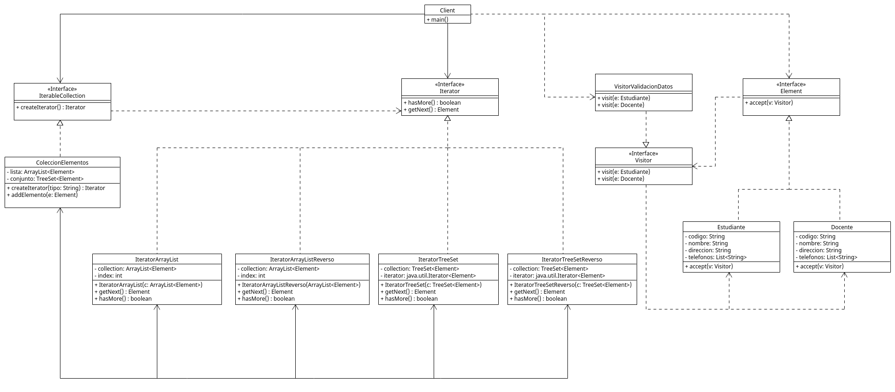

# Sistema de Gestión de Datos Estudiantiles

***

## Grupo 1 (Integrantes)

* Juan Sebastian Vega Diaz 20231020087
* Felipe Cardenas Mora 20231020145
* Yuber Alejandro Bohorquez Roa 20231020195
* David Santiago Neira Bohorquez 20192020086
* Juan Felipe Chibuque López 20232020093

***

## UML



***

## Descripción del Proyecto

Este proyecto en Java tiene como objetivo la creación de un sistema que permite almacenar, recorrer y procesar información de personas (estudiantes y docentes), aplicando los patrones de diseño **Iterator** y **Visitor**.

A partir del escenario problema planteado, se estructura una solución que involucra:

* Uso de `TreeSet<Element>` y `ArrayList<Element>` para manejar colecciones ordenadas y por inserción.
* Validación y notificación sobre datos incompletos mediante el patrón Visitor.
* Diferenciación de reglas de negocio por tipo de persona (por ejemplo, docentes con códigos válidos de máximo 4 dígitos).
* Implementación de **cuatro tipos de recorrido**: ascendente y descendente, tanto para lista como para conjunto.

***

## Características

### 1. **Estructura de Datos**

* `TreeSet`: Para mantener los elementos ordenados alfabéticamente (por `toString()`).
* `ArrayList`: Para conservar el orden de inserción.

### 2. **Patrón Iterator**

* Se define una interfaz `Iterator` personalizada.
* Se implementan cuatro clases de iteradores:
  - `IteratorArrayList`: recorre la lista de inicio a fin.
  - `IteratorArrayListReverso`: recorre la lista en orden inverso.
  - `IteratorTreeSet`: recorre el conjunto en orden ascendente.
  - `IteratorTreeSetReverso`: recorre el conjunto en orden descendente.
* Esto permite recorrer cualquier colección de forma uniforme.

### 3. **Patrón Visitor**

* Se define un Visitor que valida los datos ingresados por los usuarios.
* El sistema notifica si:
  - Faltan campos como nombre, dirección o teléfonos.
  - Si el código del docente tiene más de 4 dígitos (regla específica).
* La lógica de validación está separada de las clases del modelo.

***

## Requisitos del Sistema

* Java JDK 11 o superior
* IDE compatible con Java (Eclipse, IntelliJ, VS Code)
* Maven (opcional, si deseas manejar dependencias)

***

## Estructura del Proyecto

```plaintext
src/
├── dominio/                   # Clases del modelo de negocio
│   ├── Estudiante.java
│   ├── Docente.java
│   └── Element.java
│
├── visitor/                   # Elementos del patrón Visitor
│   ├── Visitor.java
│   └── VisitorValidacionDatos.java
│
├── iterator/                  # Elementos del patrón Iterator
│   ├── Iterator.java
│   ├── IterableColeccion.java
│   ├── IteratorArrayList.java
│   ├── IteratorArrayListReverso.java
│   ├── IteratorTreeSet.java
│   └── IteratorTreeSetReverso.java
│
├── coleccion/                 # Colección contenedora
│   └── ColeccionElementos.java
│
└── app/                       # Lógica de aplicación
    └── Client.java            # Clase con el método main y menú interactivo
```
